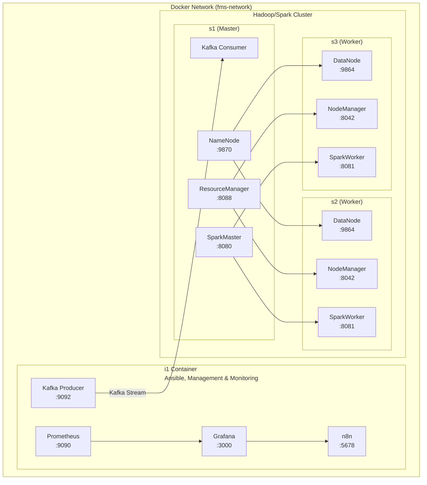

# Mermaid Chart Example

```mermaid
graph TB
    subgraph DN["Docker Network (fms-network)"]
        subgraph I1["i1 Container<br/>Ansible, Management & Monitoring"]
            KP["Kafka Producer<br/>:9092"]
            GF["Grafana<br/>:3000"]
            PM["Prometheus<br/>:9090"]
            N8N["n8n<br/>:5678"]
        end
        
        subgraph HSC["Hadoop/Spark Cluster"]
            subgraph S1["s1 (Master)"]
                KC["Kafka Consumer"]
                NN["NameNode<br/>:9870"]
                RM["ResourceManager<br/>:8088"]
                SM["SparkMaster<br/>:8080"]
            end
            
            subgraph S2["s2 (Worker)"]
                DN1["DataNode<br/>:9864"]
                NM1["NodeManager<br/>:8042"]
                SW1["SparkWorker<br/>:8081"]
            end
            
            subgraph S3["s3 (Worker)"]
                DN2["DataNode<br/>:9864"]
                NM2["NodeManager<br/>:8042"]
                SW2["SparkWorker<br/>:8081"]
            end
        end
    end
    
    KP -->|Kafka Stream| KC
    PM --> GF
    GF --> N8N
    NN --> DN1
    NN --> DN2
    RM --> NM1
    RM --> NM2
    SM --> SW1
    SM --> SW2
```
